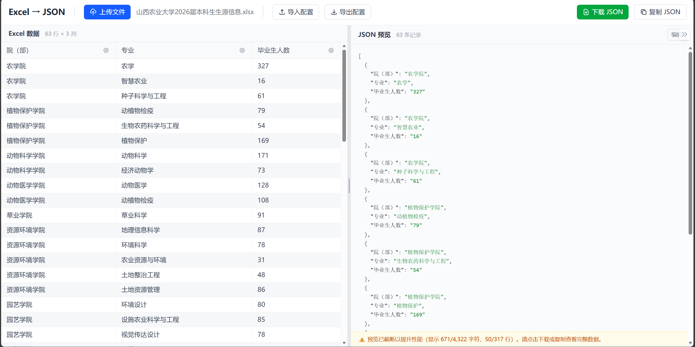

# excel2json

一个基� **SvelteKit + TypeScript** 的 Excel 转 JSON �视化工具。  
支�上传 Excel/CSV�列级映射�置��时 JSON 预览�模�导入导出�一键�制/下载。

## 功能特性

- 支�文件格�：`.xlsx`�`.xls`�`.csv`
- 左侧表格预览 Excel 数�，�侧�时预览转��的 JSON
- �列��置：
  - 目标字段�（`target`）
  - 数�类�（`string` / `number` / `boolean` / `date`）
  - 日期格�（如 `YYYY-MM-DD`�`YYYY-MM-DD HH:mm:ss`�`timestamp`）
  - 空值策略（空值时移除字段 / 使用默认值）
  - 是��用该列输出
- 支�嵌套字段：`user.address.city` 会生�嵌套对象，而�是带点字符串键�
- 支�映射模�导入/导出（JSON）
- 支�导出 JSON 文件��制 JSON 到剪贴�
- 包��元测试（`vitest`）

## 技术栈

- `Svelte 5` + `SvelteKit 2`
- `TypeScript`
- `Tailwind CSS 4`
- `xlsx`（SheetJS）
- `dayjs`
- `Vitest`

## 快速开始

### 1) 安装�赖

```bash
npm install
```

### 2) �动开��境

```bash
npm run dev
```

默认地�通常为：`http://localhost:5173`

### 3) �建�预览

```bash
npm run build
npm run preview
```

## 使用说�

1. 上传或拖拽 Excel/CSV 文件
2. 在左侧点击列头“设置�调整映射规则
3. �侧�时查看 JSON 结�
4. �导出当�映射为模�，供�续�用
5. 使用“下载 JSON�或“�制 JSON�输出结�

## 映射模�格�

模�是一个 JSON 数组，�一项对应一列�置。示例：

```json
[
  {
    "source": "姓�",
    "target": "user.name",
    "type": "string",
    "excludeIfEmpty": false,
    "defaultValue": ""
  },
  {
    "source": "入�日期",
    "target": "user.joinDate",
    "type": "date",
    "format": "YYYY-MM-DD",
    "excludeIfEmpty": true
  }
]
```

## 开�脚本

- `npm run dev`：�动开��务器
- `npm run build`：生产�建
- `npm run preview`：预览�建产物
- `npm run check`：类�� Svelte 检查
- `npm run test`：�行测试（�次）
- `npm run test:unit`：�行 Vitest（交互模�）

## 项目结�（核心）

- `src/routes/+page.svelte`：主页��整体交互
- `src/lib/excel.ts`：Excel/CSV 读��解�
- `src/lib/converter.ts`：映射转�核心逻辑
- `src/lib/types.ts`：类�定义（`MappingConfig`�`RowData` 等）
- `src/lib/components/ExcelTable.svelte`：左侧数�表格
- `src/lib/components/ColumnConfig.svelte`：列映射�置��
- `src/lib/components/JsonPreview.svelte`：�侧 JSON 预览

## 注�事项

- 日期字段会尽�兼容 Excel �列日期（数字日期）
- 当 `excludeIfEmpty = true` 时，空值字段�会出�在输出 JSON 中
- 若目标字段包� `.`，会按路径写入嵌套对象

## ½çÃæ½Øͼ




